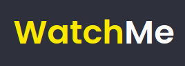

   

<h4 align="center">
      
    

      <a href="#-about">About</a>&nbsp;&nbsp;&nbsp;|&nbsp;&nbsp;&nbsp;
      <a href="###-Conteúdo">Content</a>&nbsp;&nbsp;&nbsp;|&nbsp;&nbsp;&nbsp;
      <a href="#-technologies">Technologies</a>&nbsp;&nbsp;&nbsp;|&nbsp;&nbsp;&nbsp;
      <a href="#-how-to-run-the-project">Run</a>&nbsp;&nbsp;&nbsp;|&nbsp;&nbsp;&nbsp;
      <a href="#-info">Info</a>&nbsp;&nbsp;&nbsp;|&nbsp;&nbsp;&nbsp;
      <a href="#-changelog">Changelog</a>&nbsp;&nbsp;&nbsp;|&nbsp;&nbsp;&nbsp;
      <a href="#-license">License</a>
  

</h4>

## 🔖 About

Repositório onde se encontra todos os projetos desenvolvidos na trilha de ReactJS do Ignite da Rocketseat.

### 📌 Conteúdo
- [Projetos](#-projetos)
  - [Chapter I](#chapter-i)
    - [Github Explorer](#github-explorer)
  - [Chapter II](#chapter-ii)
    - [DT Money](#dt-money)
    

- [Desafios](#-desafios)
  - [Chapter I](#chapter-i-1)
    - [To.do](#chapter-i-1)
    - [Watchme](#chapter-i-1)
  - [Chapter II](#chapter-ii-1)
    - [Rocketshoes](#chapter-ii-1)
    - [GoRestaurant](#chapter-ii-2)

## 🚀 Projetos
### Chapter I
#### Github Explorer

  

### Chapter II
#### DT Money

  

## 🚀 Desafios
### Chapter I

  

  

### Chapter II

  

  

## 🚀 Technologies

- [ReactJS](https://pt-br.reactjs.org/)

## ℹ️ Info

## 📄 Changelog

[See here](docs/changelog.md)

[MIT](LICENSE)

**Free Software, Hell Yeah!**
